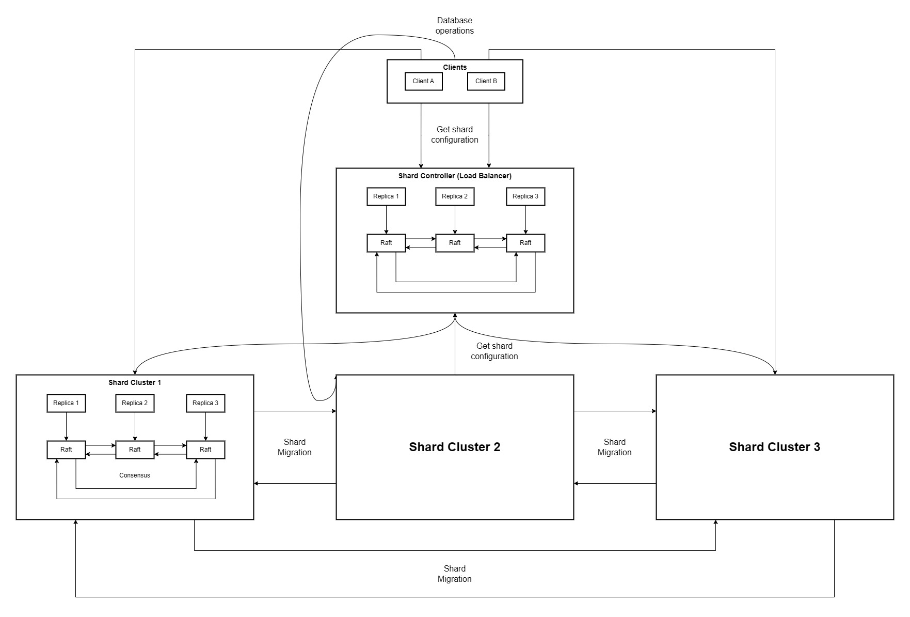

[](https://github.com/Jona-Han/Sharded_KVS/actions/workflows/ci.yml)

# HyperShardDB

HyperShardDB is a robust fault-tolerant sharded key/value database with dynamic shard reconfiguration using Raft

## Key Features 🌟
- **Replication**: Each shard contains at least 2*f + 1 replicas, where f is the maximum number of allowed server failures, guaranteeing fault and partition tolerance.
- **Load Balancing and Sharded Architecture**: Efficiently spreads keys across up to 10 shards to improve load balancing and manages shard configuration changes through a shard controller.
- **Sequential Consistency**: Utilizes the Raft consensus algorithm to guarantee an agreed-upon order of all actions.
- **Snapshots and Shard Deletion**: Uses periodic snapshotting and shard deletion mechanisms to efficiently manage storage space.


## Architecture

The system is composed of two main components:

1. **Shard Replica Groups**: These groups are responsible for storing and serving key/value pairs. Each group uses Raft to replicate data and handle client requests such as `Get`, `Put`, and `Append`.
2. **Shard Controller**: This component maintains the configuration of shard assignments to replica groups. It handles `Join`, `Leave`, `Move`, and `Query` operations to manage shard distribution dynamically.



## Implementation Details

- **Raft Consensus Algorithm**: Used within each replica group to manage the replication of data and ensure consistency.
- **Configuration Management**: The shard controller periodically updates the configuration to balance load and manage the addition or removal of replica groups.
- **Fault Tolerance**: By replicating data across multiple nodes, the system can tolerate node failures and continue to operate without data loss.
- **RPC**: All communication between servers are performed through remote procedure calls.

## Prerequisites 📝
* Go programming language (version 1.2 or later)
* Docker
* Git for version control
* Operating System: Linux, macOS, or Windows 10
  
## Getting Started 🚀

1. **Clone the Repository:**
    ```sh
    https://github.com/Jona-Han/HyperShardDB.git
    ```

2. **Install Dependencies:**
    Ensure Go is installed and properly configured on your system.

3. **Setup and Run with Docker:**

    Use Docker Compose to build and start the services.

    ```sh
    cd src
    docker-compose up --build
    ```

    This will do the following:
    - Build the Docker images for each server.
    - Start the containers and set up the network.

4. **Stop and Remove Containers:**

    To stop and remove all the running containers, you can use the following command:

    ```sh
    docker-compose down
    ```

### Running Tests
1. **Running the Full Test Suite:**
    ```sh
    go test ./...
    ```

